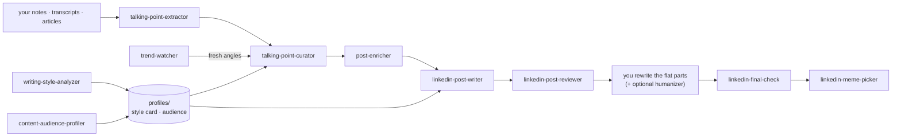

# Skills with Aura ✨

**English** · [Русский](README.ru.md)

[Claude Code](https://code.claude.com) skills that turn raw notes, transcripts, and articles into
LinkedIn posts that sound like you wrote them — researched, structured, drafted, and reviewed on
your machine. No API keys, no accounts, nothing uploaded.


*One paste into the composer — every beat of the "Old Way vs New Way" template accounted for.
(Source for the animation lives in [`demo/`](demo/), rendered with Remotion.)*

## The pipeline



**Set up once** — `writing-style-analyzer` distills your best writing into a reusable style card;
`content-audience-profiler` builds a research-backed profile of who you're writing for. Both save to
`content-workspace/profiles/` and feed everything downstream.

**Per post** — extract angles from source material, curate them into a queue, enrich the pick with a
story or verifiable stat, draft 2–3 template-based variants in your voice, get a blunt review, make
it yours, pass the SHIP/HOLD gate, and optionally turn it into a meme board.

**Anytime** — `trend-watcher` scans Reddit, X, Hacker News, and the web for what's live in your
audience's world and hands back sourced angles with the take only you can supply.

## The skills

| Skill | What it does |
|---|---|
| `writing-style-analyzer` | your best writing in, a reusable style card out |
| `content-audience-profiler` | a research-backed profile of who you're writing for |
| `talking-point-extractor` | transcripts, articles, notes → post-ready angles |
| `talking-point-curator` | ranks angles into a post queue for your lane |
| `post-enricher` | adds a story, example, or verifiable stat so a point lands |
| `linkedin-post-writer` | drafts 2–3 variants on proven post templates, in your voice |
| `linkedin-post-reviewer` | a blunt critique against what actually performs |
| `linkedin-final-check` | the last SHIP/HOLD gate before you publish |
| `linkedin-meme-picker` | maps a cleared post to a fitting meme template, returns a meme board |
| `trend-watcher` | live conversations on Reddit/X/HN → sourced post angles |

## Use a skill

Every skill is a plain folder under [`skills/`](skills/). Install one by copying its folder into
your Claude Code skills directory:

```bash
git clone https://github.com/acogood/skills_with_aura
cp -r skills_with_aura/skills/linkedin-post-writer ~/.claude/skills/   # available everywhere
# …or scope it to one project:  cp -r skills_with_aura/skills/<name> .claude/skills/
```

Then just ask — *"draft a LinkedIn post from these notes"* — or name the skill directly. Take as
many as you like; each one works standalone and reads whatever the earlier skills already saved.

**Make it yours before you publish.** Don't ship AI slop: read the draft end to end and rewrite the
flat parts in your own voice. For an extra pass, the external
**[humanizer](https://github.com/blader/humanizer)** skill (`npx skills add blader/humanizer`)
strips signs of AI writing — run it partially, so it removes tells without smoothing away your hooks.

## Where your work is saved

Skills read and write a `content-workspace/` folder in your current project — everything stays on
your machine:

```
content-workspace/
├── profiles/        audience profiles + style cards (shared across skills)
├── sources/         your inputs (writing samples, transcripts/articles)
└── talking-points/ content/        generated angles, queues, drafts, meme boards
```

For a video source, paste YouTube's **Show transcript** panel or drop a captions file into
`content-workspace/sources/` — Claude can't reliably fetch captions on its own. See
[getting-a-transcript.md](skills/talking-point-extractor/getting-a-transcript.md).

## Contributing

A skill is a folder under `skills/` with a `SKILL.md`: YAML frontmatter (`name` matching the folder,
plus a `description` that says what it does and when to use it) followed by the instruction body.
Add or sharpen one and open a PR.

## License

[MIT](LICENSE).
