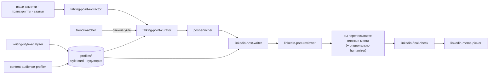

# Skills with Aura ✨

[English](README.md) · **Русский**

Скилы для [Claude Code](https://code.claude.com), которые превращают сырые заметки, транскрипты
и статьи в посты для LinkedIn, которые звучат как вы, — с ресёрчем, структурой, черновиком и ревью
на вашей машине. Без API-ключей, без аккаунтов, ничего никуда не отправляется.


*Один paste в композер — и каждый бит шаблона "Old Way vs New Way" на месте.
Исходник анимации — в [`demo/`](demo/), рендер на Remotion.*

## Пайплайн



**Настроить один раз** — `writing-style-analyzer` дистиллирует ваши лучшие тексты в переиспользуемую
style card; `content-audience-profiler` собирает исследовательский профиль того, для кого вы пишете.
Оба сохраняются в `content-workspace/profiles/` и кормят всё остальное.

**На каждый пост** — достаньте углы из исходника, откурируйте их в очередь, обогатите выбранный
историей или проверяемой цифрой, соберите черновик в 2–3 вариантах на проверенных шаблонах поста
вашим голосом, получите блант-ревью, сделайте пост своим, пройдите гейт SHIP/HOLD и при желании
превратите в мем-борд.

**В любой момент** — `trend-watcher` сканирует Reddit, X, Hacker News и веб на то, что прямо сейчас
живёт в мире вашей аудитории, и отдаёт углы с источниками — с тейком, который можете дать только вы.

## Скилы

| Скил | Что делает |
|---|---|
| `writing-style-analyzer` | ваши лучшие тексты на входе — переиспользуемая style card на выходе |
| `content-audience-profiler` | исследовательский профиль того, для кого вы пишете |
| `talking-point-extractor` | транскрипты, статьи, заметки → готовые к посту углы |
| `talking-point-curator` | ранжирует углы в очередь постов под вашу полосу |
| `post-enricher` | добавляет историю, пример или проверяемую цифру, чтобы мысль зашла |
| `linkedin-post-writer` | черновики в 2–3 вариантах на проверенных шаблонах поста, вашим голосом |
| `linkedin-post-reviewer` | блант-критика против того, что реально заходит |
| `linkedin-final-check` | последний гейт SHIP/HOLD перед публикацией |
| `linkedin-meme-picker` | мапит прошедший пост на подходящий мем-шаблон, отдаёт мем-борд |
| `trend-watcher` | живые разговоры на Reddit/X/HN → углы с источниками |

## Как пользоваться скилом

Каждый скил — это обычная папка в [`skills/`](skills/). Чтобы установить, скопируйте её папку в
директорию скилов Claude Code:

```bash
git clone https://github.com/acogood/skills_with_aura
cp -r skills_with_aura/skills/linkedin-post-writer ~/.claude/skills/   # доступно везде
# …или только в одном проекте:  cp -r skills_with_aura/skills/<name> .claude/skills/
```

Дальше просто попросите — *«набросай пост в LinkedIn из этих заметок»* — или назовите скил напрямую.
Берите сколько угодно; каждый работает standalone и читает всё, что уже сохранили предыдущие скилы.

**Сделайте пост своим до публикации.** Не плодите ИИ-слоп: прочитайте черновик целиком и перепишите
плоские места в своём стиле. Для отдельного прохода есть внешний скил
**[humanizer](https://github.com/blader/humanizer)** (`npx skills add blader/humanizer`) — снимает
признаки AI-письма; прогоняйте его частично, чтобы убрать тэллы, но не загладить хуки.

## Где сохраняется работа

Скилы читают и пишут в папку `content-workspace/` в вашем текущем проекте — всё остаётся на
вашей машине:

```
content-workspace/
├── profiles/        профили аудитории + style cards (общие для скилов)
├── sources/         ваши входные данные (примеры текстов, транскрипты/статьи)
└── talking-points/ content/        сгенерированные углы, очереди, черновики, мем-борды
```

Для видео вставьте панель **Show transcript** из YouTube или положите файл субтитров в
`content-workspace/sources/` — сам Claude не умеет надёжно тянуть субтитры. См.
[getting-a-transcript.md](skills/talking-point-extractor/getting-a-transcript.md).

## Контрибьютинг

Скил — это папка в `skills/` с файлом `SKILL.md`: YAML-фронтматтер (`name` совпадает с именем папки,
плюс `description`, где сказано, что скил делает и когда его применять), дальше — тело инструкции.
Добавьте новый или заострите существующий и откройте PR.

## Лицензия

[MIT](LICENSE).
