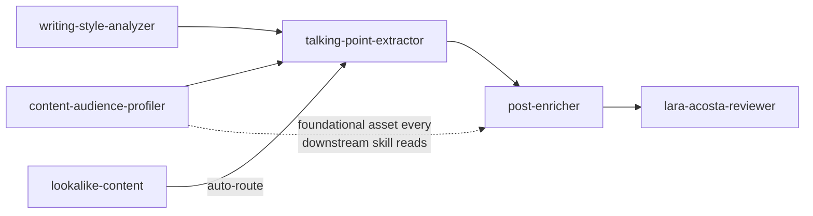
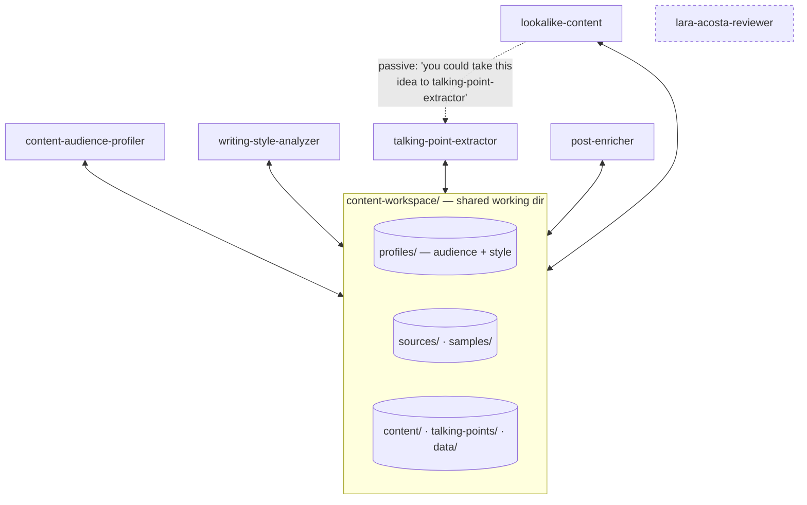

# refactor: Make content-writing skills standalone (not a pipeline)

**Created:** 2026-06-29
**Type:** refactor
**Depth:** Standard
**Target repo:** skills_with_aura

---

## Summary

Rework the six `content-writing` skills so each is genuinely dedicated and standalone — independently discoverable and launchable — instead of links in a fixed pipeline. Skills keep sharing a single working directory (`content-workspace/`): each writes its outputs there and reads a sibling's outputs from there *if present*, degrading gracefully when absent. Ordering becomes emergent (the user launches skills one by one, or describes a goal and the model picks which skill fires first/next) rather than encoded into the skills. Per the confirmed call-outs, skills carry **slight awareness** of each other and `lookalike-content`'s current auto-route into `talking-point-extractor` is downgraded to a **passive suggestion**.

Two refinements came out of the document-review pass: "slight awareness" is implemented as a **generic per-skill pointer to a central skills map** (not a hand-maintained adjacency list in each file), and the one real cross-skill **filename collision** is removed at the source by renaming `lookalike-content`'s winning-content output out of the audience-profile scan path.

This is an editorial/convention refactor of markdown skill files and two repo docs, plus one output-path rename. No skill *analytical logic*, research script, output-template structure, or bundled course material changes.

---

## Problem Frame

The skills were ported from a private origin repo where they were stages of an "AI CMO" content pipeline (see `PORTING-NOTES.md`). That framing survives in the public plugin and contradicts the goal of dedicated skills:

- Two producer skills bill themselves as a **foundational asset that "every downstream content skill … reads from,"** naming skills that **do not exist in this plugin** (`hook creator`, `post drafter`, `newsletter writer`, `content idea generators`). The framing appears in their Overviews, in their `description` frontmatter (e.g. `content-audience-profiler` line 3: "…a 10-section profile that downstream content skills read from … (not pipeline enrichment)"), and throughout their bundled templates.
- `lookalike-content` **auto-routes** a selected idea into `talking-point-extractor` ("If they pick 1, route to the Talking Point Extractor with the selected idea as input").
- `talking-point-extractor` still lists hardcoded `ai-cmo-workspace/ai-cmo-saas/…` source paths from the origin repo.
- Every skill `description` carries a dead `Do NOT trigger during AI CMO pipeline work` anti-trigger referencing a context absent from this plugin — **including `lara-acosta-reviewer` line 3** — which can muddy triggering.
- `README.md` and `CLAUDE.md` describe a "pipeline"; `CLAUDE.md` also documents the now-doomed anti-trigger convention (~line 109) and the `ai-cmo-workspace` rough edge (~lines 123–124).

The underlying mechanism we *want* is already mostly present: skills read/write `content-workspace/` and most already ask the user when an expected profile is missing. The work is to remove the pipeline framing, keep the loose shared-folder coupling, make each skill self-contained and discoverable, and close the one latent collision the new "run in any order" freedom would otherwise amplify.

---

## Requirements

- **R1** — Each skill is independently discoverable and launchable; its `description` states what it does, when to trigger, and its boundary, with no reference to the absent "AI CMO pipeline" or to non-existent skills as required steps.
- **R2** — No skill auto-launches or hard-routes into another. Any inter-skill reference is a passive suggestion only (slight awareness).
- **R3** — Skills share `content-workspace/`: each that produces a saved artifact writes it there, and reads a sibling's outputs from there *if present*, degrading gracefully (ask the user, or proceed) when absent. No skill fails because an "upstream" skill didn't run. (`lara-acosta-reviewer` is the documented exception — it reviews a pasted/pointed-at draft and returns its review in-conversation; it does not use `content-workspace/`.)
- **R4** — Each skill carries a consistent, lightweight note: it works standalone, names the shared working directory (where applicable), and points to the README for the rest of the set — nothing launches automatically. The related-skills *map* lives centrally (README/`CLAUDE.md`), not as a hand-maintained sibling list inside each skill.
- **R5** — `README.md` and `CLAUDE.md` describe a set of independent skills that share a workspace, not a fixed sequence, and serve as the central skills map.
- **R6** — No change to any skill's core analytical behavior, output-template structure/content, the Python research scripts, or the bundled course material / licensing — **except** the intentional output-location/name change in U8, required to remove the cross-skill filename collision.
- **R7** — Skill outputs are namespaced so filename-substring discovery cannot match the wrong artifact: no skill writes a file containing another reader's discovery substring (`profile`, `style`) into that reader's scan path unless it *is* that artifact type.

---

## High-Level Technical Design

The coupling model, before and after. The change is conceptual (how skills relate), so the shape is what matters — the implementation is prose edits plus one path rename.

**Before — implied pipeline + one hard auto-route:**

**After — independent skills, hub on the shared folder, one passive suggestion, central map:**

Target model: every artifact-producing skill reads/writes the shared folder on its own; `lara-acosta-reviewer` stands apart (no `content-workspace/` use). The only inter-skill link is the one dashed, passive, human/model-initiated suggestion kept in `lookalike-content`. Each skill's awareness note is a *generic* pointer to the README map — no per-skill adjacency list. Orchestration lives in the model's skill selection and the user's choices, not in the skills.

---

## Key Technical Decisions

- **KTD1 — Keep loose coupling via the shared filesystem; do not add an orchestrator or machine-readable cross-links.** Skills compose through `content-workspace/` files discovered by filename substring (`profile`, `style`, `talking-points-`, etc.). An orchestrator skill or an inter-skill edge manifest would re-introduce a pipeline. The known weakness of substring discovery — matching the *wrong* file — is closed by R7/U8 (namespacing outputs) rather than by abandoning the mechanism.
- **KTD2 — Implement "slight awareness" as a generic pointer + central map, not per-skill adjacency lists.** Each `SKILL.md` gets one short, sibling-agnostic note ("other content-writing skills share this workspace — see the README; nothing launches automatically"). The actual list of skills lives in the README table and `CLAUDE.md`. Rationale: a hand-maintained "related skills" list duplicated across six files re-creates the exact maintenance coupling and stale-name defect this refactor removes, and a dense mutual-reference graph is no longer "slight."
- **KTD3 — Reframe, don't re-engineer, graceful degradation.** Most skills already ask when an expected profile is absent. The edit removes language asserting a *required upstream*; it does not rewrite input-loading logic. Where a mode genuinely benefits from a prior artifact (e.g. style-analyzer Mode 2 wants an audience profile), keep the existing *offer to run it or switch modes* — already passive.
- **KTD4 — The `description` frontmatter is the lever for "the LLM figures out which to launch."** Retune descriptions (remove the dead AI-CMO anti-trigger; add a real boundary only where its removal leaves none) rather than touching skill bodies' logic, and verify with inter-skill trigger evals because the six skills share a domain and can confuse each other.
- **KTD5 — Downgrade the `lookalike-content` auto-route to a passive suggestion (per confirmed call-out), don't delete it.** Preserves the one discoverable composition path without auto-firing or transferring state. This is the single intentionally-named inter-skill suggestion (distinct from KTD2's generic notes).
- **KTD6 — Resolve the profile-substring collision by renaming the output, not by adding disambiguation logic (per confirmed decision).** `lookalike-content` writes `winning-content-profile-[platform].md` into `content-workspace/profiles/`, where it collides with the `profile` substring that audience-profile readers scan for. Move/rename it out of the scan path (U8). Rationale: removes the ambiguity at the source so every reader stays simple, rather than teaching each reader to exclude a sibling's filename.

---

## Scope Boundaries

**In scope:** the six `SKILL.md` files and their bundled template/guide assets under `plugins/content-writing/skills/`; the `lookalike-content` winning-content output path/name; `README.md`; `CLAUDE.md`.

**Out of scope (R6):**
- Adding, removing, or merging skills.
- The Python research helpers in `plugins/content-writing/scripts/`.
- The *structure/content* of output templates (only the "downstream skills read this" framing inside them changes; behavioral instructions are preserved, see U1).
- `NOTICE.md` / `LICENSE` and anything under `assets/linkedin-comeback/`.
- `marketplace.json` / `plugin.json` plugin descriptions — already menu-shaped; leave unless an edit elsewhere makes them inaccurate.

### Deferred to Follow-Up Work
- A formal `skill-creator` trigger-eval **benchmark with variance analysis** across all six descriptions. U4 uses a lightweight multi-run inter-skill trigger check as verification; the rigorous benchmark is deferred **until** the U4 check shows unstable selection (the same prompt picking different skills across runs) — at which point it becomes blocking, not follow-up.
- The `PORTING-NOTES.md` §1 idea of an explicit "if no profile in `content-workspace/profiles/`, offer the bundled examples in `${CLAUDE_PLUGIN_ROOT}/assets/examples/profiles/`" fallback. This is a behavior addition beyond decoupling; keep it fully deferred (U5 only *describes* the existing ask/proceed degradation — it adds no new behavior).

---

## Implementation Units

### U1. Neutralize "foundational asset / downstream skill" framing in the producer skills and their templates

**Goal:** Remove the claim that the audience profile and style card are a foundational input that "every downstream content skill reads," and stop naming skills that don't exist in this plugin — across the producers' Overviews, `description` frontmatter, and templates. Reframe each as a standalone artifact whose output is reusable by anything (a person, or another skill) that later reads the shared folder. **Preserve behavioral instructions** that happen to be phrased as "downstream skill" guidance.

**Requirements:** R1, R2, R5.
**Dependencies:** none. (Note: U4 also edits the two producer `description` lines — for the AI-CMO anti-trigger only — so the two units must land sequentially, not in parallel, on those files.)
**Files:**
- `plugins/content-writing/skills/content-audience-profiler/SKILL.md` (description line ~3 — reword "…profile that downstream content skills read from" and drop "(not pipeline enrichment)"; Overview line ~11; quality-rule line ~199)
- `plugins/content-writing/skills/content-audience-profiler/profile-template.md` ("Why it's here" notes at ~31, 53, 76, 109, 141, 177; **instruction-bearing** notes at ~167 and ~272)
- `plugins/content-writing/skills/content-audience-profiler/html-template-guide.md` (~23)
- `plugins/content-writing/skills/writing-style-analyzer/SKILL.md` (description line ~3 if it carries the same framing; Overview line ~11)
- `plugins/content-writing/skills/writing-style-analyzer/style-card-template.md` (~74)

**Approach:** Replace "every downstream content skill (hook creator, post drafter, newsletter writer …) reads from" with accurate, skill-agnostic wording — e.g. "a reusable reference; when you (or another content skill) write from it later, it sets tone, depth, and vocabulary." **Distinguish two kinds of note** before editing:
- *Motivational rationale* ("Why it's here" explanations) — keep the rationale, only fix the false named-chain.
- *Behavioral instructions* addressed to a reader — e.g. profile-template ~167 "instruct downstream skills to rotate them" and ~272 "Each platform-specific content skill reads ONLY its relevant subsection." These are load-bearing; **rephrase reader-agnostic while keeping the instruction** ("rotate these 5 hooks rather than reusing one"; "a reader uses only the relevant platform subsection"). Do not delete them as if they were stray pipeline framing.

Do not rename template sections or change template structure (R6).

**Patterns to follow:** the existing template prose voice; keep "Why it's here" as the note label.

**Test scenarios:**
- `grep -rniE "downstream|foundational asset|hook creator|post drafter|newsletter writer|content idea generator" plugins/content-writing/skills/content-audience-profiler plugins/content-writing/skills/writing-style-analyzer` returns no matches (covers the description line 3 and templates).
- Read both Overviews and descriptions: each describes a self-contained deliverable, no required downstream consumer, no "(not pipeline enrichment)" clause.
- The two instruction-bearing notes (~167, ~272) still convey their behavioral rule in reader-agnostic wording — Covers R6 (no behavior loss).
- Each `profile-template.md` "Why it's here" note still explains *why the section matters* (rationale retained).

**Verification:** Producer skills + templates read as standalone; no non-existent skill named; behavioral guidance intact.

---

### U2. Downgrade the `lookalike-content` auto-route to a passive suggestion

**Goal:** `lookalike-content` no longer auto-routes into `talking-point-extractor`; it offers it as an optional next step the user may choose, with no automatic invocation or state transfer. This is the one intentionally-named inter-skill suggestion (KTD5).

**Requirements:** R2.
**Dependencies:** none.
**Files:** `plugins/content-writing/skills/lookalike-content/SKILL.md` (next-steps menu ~401–415, esp. "feeds into the content system" ~409 and "route to the Talking Point Extractor" ~415).

**Approach:** Rewrite the post-output options so option 1 reads as a passive suggestion (e.g. "Take one of these ideas further — `talking-point-extractor` can turn it into post-ready talking points (run it yourself when you're ready)"). Delete the "If they pick 1, route to the Talking Point Extractor with the selected idea as input" instruction and any implication that selecting it auto-launches another skill. Keep the other menu options.

**Patterns to follow:** the passive offer style already used in `writing-style-analyzer` ("offer to run the Content Audience Profiler first or switch modes").

**Test scenarios:**
- `grep -niE "route to|feeds into the content system" plugins/content-writing/skills/lookalike-content/SKILL.md` returns no matches.
- Read the menu: the `talking-point-extractor` mention is user-initiated, no auto-invocation — Covers R2.

**Verification:** The handoff is discoverable but never auto-fires.

---

### U3. Generalize `talking-point-extractor` source inputs (drop `ai-cmo-workspace` paths)

**Goal:** Remove the hardcoded origin-repo source paths and replace them with generic, portable input guidance.

**Requirements:** R1, R6.
**Dependencies:** none.
**Files:** `plugins/content-writing/skills/talking-point-extractor/SKILL.md` (the `ai-cmo-workspace/ai-cmo-saas/…` source list ~36–45, and the "substitute accordingly / look in the appropriate workspace path" note ~45).

**Approach:** Replace the AI-CMO source-path block with the portable inputs the skill already supports: pasted text, a user-supplied file path, and files in `content-workspace/sources/`. Keep extraction behavior unchanged (R6). (The body-level `Do NOT use during AI CMO pipeline analysis work` line ~28 is handled in U4 alongside the description.)

**Patterns to follow:** the `content-workspace/sources/` convention documented in `README.md`.

**Test scenarios:**
- `grep -niE "ai-cmo-workspace|ai-cmo-saas" plugins/content-writing/skills/talking-point-extractor/SKILL.md` returns no matches.
- Read the Inputs section: source options are pasted text / file path / `content-workspace/sources/`, no origin-repo assumptions.
- Run the skill on a pasted transcript with no `content-workspace/`: it extracts talking points without referencing missing workspace paths (behavior unchanged — R6).

**Verification:** Inputs are portable; extraction behavior preserved.

---

### U4. Retune all six skill descriptions for standalone discoverability

**Goal:** Make each skill independently discoverable by **removing the dead `Do NOT trigger during AI CMO pipeline work` anti-trigger from every description**, and substituting a real boundary (what the skill is *not* for) **only where that clause was the description's sole boundary**. This is scoped to decoupling — it is *not* a blanket rewrite of every description to a what+when+boundary standard.

**Requirements:** R1.
**Dependencies:** U3 (both touch `talking-point-extractor/SKILL.md`); coordinate with U1 (both touch the two producer `description` lines). Sequence after U1 and U3.
**Files (frontmatter `description`, plus the one body anti-trigger in talking-point-extractor):**
- all six `SKILL.md` under `plugins/content-writing/skills/`, **including `lara-acosta-reviewer/SKILL.md` line 3, which DOES contain `Do NOT trigger during AI CMO pipeline work.`** — treat it like the other five (excise + add a real boundary), not merely "confirm."
- `plugins/content-writing/skills/talking-point-extractor/SKILL.md` body line ~28 (`Do NOT use during AI CMO pipeline analysis work`).

**Approach:** Keep each description's existing, well-tuned trigger phrases. Excise the AI-CMO anti-trigger everywhere. Where removing it leaves a description with no boundary, add a genuine one (e.g. `post-enricher`: "not for writing a post from scratch — use it to add proof/story to an existing point"). The producers' "downstream/pipeline-enrichment" wording in their descriptions is owned by U1; U4 touches only the anti-trigger on those two lines. Do not change `name` or body logic.

**Patterns to follow:** `CONTRIBUTING.md` §"SKILL.md frontmatter"; `lara-acosta-reviewer`'s description body is already a good what+when+boundary exemplar (apart from the anti-trigger being removed).

**Test scenarios (trigger eval — lightweight, via the `skill-creator` trigger-eval loop or manual prompts after local install):**
- Positive (each fires its own skill): "build me an audience profile for X" → `content-audience-profiler`; "capture this creator's writing voice" → `writing-style-analyzer`; "pull talking points from this transcript" → `talking-point-extractor`; "add a story to this post" → `post-enricher`; "find what's working in my posts and give me ideas" → `lookalike-content`; "review this LinkedIn draft like Lara" → `lara-acosta-reviewer`.
- **Inter-skill near-misses (the real regression for six same-domain skills — run each a few times to gauge selection stability):** "pull content ideas from my posts" should resolve predictably between `talking-point-extractor` and `lookalike-content` (define which owns it and confirm the boundary makes it stable); "capture this voice" vs "design a voice for content" both sit inside `writing-style-analyzer`'s modes and must not leak to another skill; "write me a LinkedIn post from scratch" should fire none of the six strongly (no skill owns from-scratch drafting).
- `grep -rniE "AI CMO pipeline|ai cmo pipeline" plugins/content-writing/skills` returns no matches (including `lara-acosta-reviewer`).

**Verification:** Each skill fires on its intended prompts; inter-skill near-misses resolve stably across repeated runs; no description references an absent context. If selection is unstable across runs, escalate to the deferred variance benchmark (now blocking).

---

### U5. Add a uniform "works standalone + shared workspace + central pointer" note to each skill

**Goal:** Deliver "slight awareness" consistently as a generic, sibling-agnostic note (KTD2): every `SKILL.md` declares it runs on its own, names `content-workspace/` as the shared place it reads/writes (where applicable), states it uses a sibling's output *if present* (otherwise asks or proceeds), and points to the README for the rest of the set with an explicit "nothing auto-runs" caveat. No per-skill enumerated sibling list.

**Requirements:** R2, R3, R4.
**Dependencies:** U1 (its note is placed under the H1/Overview region U1 rewrites in the two producers) and U4 (descriptions finalized first). Sequence after U1 and U4 on the shared files.
**Files:** all six `SKILL.md` under `plugins/content-writing/skills/`.

**Approach:** Add one short, identically-shaped section per skill (placed consistently — e.g. directly under the H1/Overview). Template for the five workspace-using skills:

> **Works standalone.** Run this skill on its own. It reads and writes under `content-workspace/` in your project. If a related skill already saved something useful there (e.g. an audience profile in `content-workspace/profiles/`), this skill uses it; otherwise it asks you or proceeds without it. The other content-writing skills share this same workspace — see the README for the set. Nothing launches automatically.

Tailor only the "useful thing it looks for" example per skill — **do not enumerate sibling skills by name** (the README is the map).

**Special-case `lara-acosta-reviewer`** (it uses no `content-workspace/` — it reviews a pasted/pointed-at draft and loads its bundled `${CLAUDE_PLUGIN_ROOT}/assets/linkedin-comeback/` corpus, returning the review in-conversation): drop the "reads and writes under `content-workspace/` … uses a saved profile" claim. Its note keeps only: works standalone, reviews a draft you paste or point it at (plus its bundled course corpus), the README pointer, and "nothing auto-runs." Leave its existing scope-boundary references ("that's `lookalike-content` / `talking-point-extractor` / `post-enricher` territory") as-is — they are *negative* boundaries, not a run-next adjacency list.

**Patterns to follow:** `CONTRIBUTING.md` lean-body guidance; the existing graceful "if none found, ask" handling each skill documents.

**Test scenarios:**
- All six `SKILL.md` contain the note; `grep -rl "Works standalone" plugins/content-writing/skills` lists six files.
- No note enumerates sibling skills by name (the five workspace skills point to the README; lara keeps only its negative boundaries) — Covers R4/KTD2.
- The `lara-acosta-reviewer` note makes no `content-workspace/` read/write claim — Covers R3 exception.
- Each note contains explicit "nothing launches automatically" (or equivalent) — Covers R2.
- Integration: after a local marketplace install, run `content-audience-profiler` then `post-enricher` in the same project — `post-enricher` picks up the profile from `content-workspace/profiles/` with no auto-handoff; then run `post-enricher` in a clean project (no `content-workspace/`) and confirm it asks "Who is this content for?" instead of erroring — Covers R3.

**Verification:** Consistent, accurate, generic awareness across all six; lara note matches its real behavior; shared-folder pickup and clean-project graceful behavior both hold.

---

### U6. Reframe `README.md` from pipeline to independent-skills menu (the central map)

**Goal:** The README presents six independent skills that share a workspace and compose in any order, and serves as the central related-skills map the per-skill notes point to.

**Requirements:** R4, R5.
**Dependencies:** U1–U5, U8 (docs reflect final state, incl. the renamed output path).
**Files:** `README.md` (the `### How they fit together` section ~40–50 and its diagram; the `content-workspace/` tree if it lists the renamed winning-content path).

**Approach:** Keep the skills table (already a menu — this is the central map). Replace "How they fit together / A natural pipeline" + the arrow diagram with a short "How they compose" note: each works standalone, they share `content-workspace/`, run them in any order or describe a goal and let Claude pick. Keep a *non-prescriptive* "common combinations" line framed as examples, not a required flow. Update the `content-workspace/` tree to reflect U8's output location.

**Test scenarios:**
- `grep -niE "pipeline|each step" README.md` returns no matches (the rewritten section contains neither token).
- Read the section: composition is described as optional/any-order; the skills table reads as the map the per-skill notes reference.

**Verification:** README reads as a menu of dedicated skills and as the central map.

---

### U7. Reframe `CLAUDE.md` coupling description and purge invalidated conventions

**Goal:** `CLAUDE.md` describes independent skills sharing a workspace, preserves the still-true operational warnings, and contains no guidance the other units invalidate.

**Requirements:** R5.
**Dependencies:** U1–U5, U8.
**Files:** `CLAUDE.md`:
- the "six-skill content **pipeline**" line ~13 and the "shared data bus" / "The pipeline (each step works standalone)" framing ~84–90;
- the "Conventions when adding/editing skills" line ~109 that documents `Do NOT trigger during AI CMO pipeline work.` (false once U4 strips it — remove/replace);
- the "Known rough edges" bullet ~123–124 about `talking-point-extractor` still referencing `ai-cmo-workspace/…` paths (resolved by U3 — remove/replace);
- the filename-discovery description, to reflect U8's renamed winning-content output.

**Approach:** Change "six-skill content **pipeline**" → "six independent content skills." Keep the **filename-substring discovery** warning but reframe "silently break the downstream skills" → "break the other skills that look for those files," and update it to note outputs are namespaced (no cross-type collision) per U8. Reframe "pipeline (each step works standalone)" → "independent skills that compose in any order via the shared workspace; nothing auto-chains." Remove the AI-CMO anti-trigger convention (~109) and the resolved `ai-cmo-workspace` rough edge (~123–124). Leave path-discipline, two-path-research, and licensing sections unchanged.

**Test scenarios:**
- `grep -niE "pipeline|downstream" CLAUDE.md` returns no matches (any residual "standalone"/"any order" wording contains neither token).
- `grep -niE "ai-cmo-workspace|AI CMO pipeline" CLAUDE.md` returns no matches.
- The filename-discovery warning is still present and now notes the namespacing fix.
- Read-through: no claim of a fixed sequence; path/research/licensing guidance intact.

**Verification:** `CLAUDE.md` matches the new model; no invalidated convention survives; grep checks read clean.

---

### U8. Rename the `lookalike-content` winning-content output out of the profile scan path

**Goal:** Remove the cross-skill filename collision (KTD6/R7): `lookalike-content`'s winning-content artifact must no longer match the `profile` substring that audience-profile readers scan for in `content-workspace/profiles/`.

**Requirements:** R6 (intentional exception), R7.
**Dependencies:** none (U6/U7 docs depend on this landing first).
**Files:** `plugins/content-writing/skills/lookalike-content/SKILL.md` — every reference to the output: Step 5 save path (~241), the post-save summary (~262–276), the final delivery summary (~403–411), and the File Structure block (~431–451). (The bundled template asset `winning-content-profile-template.md` is internal, not in any scan path — leave its name unchanged.)

**Approach:** Save the winning-content artifact **outside `content-workspace/profiles/` and without the `profile`/`style` substrings** — e.g. `content-workspace/content/winning-content-dna-[platform].{md,html}` (the skill body already calls it a "winning content DNA document," so the name is faithful). Update all in-skill references to the new path/name. No other skill reads this artifact (it is consumed within a single `lookalike-content` run), so only in-skill references plus the two docs (U6/U7) need updating. Keep the existing "ask which one if multiple found" behavior in the profile-reading skills as defense-in-depth (no change needed there).

**Patterns to follow:** `lookalike-content`'s existing `content-workspace/content/content-ideas/` output location (a sibling content artifact already lives under `content/`).

**Test scenarios:**
- `grep -niE "profiles/winning-content-profile|winning-content-profile-\[platform\]" plugins/content-writing/skills/lookalike-content/SKILL.md` returns no matches (output no longer written to `profiles/` nor named with `profile`).
- The new output path contains neither `profile` nor `style` and is not under `content-workspace/profiles/` — Covers R7.
- Read the File Structure block + delivery summary: every reference points to the new location consistently.
- Regression: an audience-profile reader (e.g. `post-enricher`) scanning `content-workspace/profiles/` for `profile` no longer matches the winning-content artifact.

**Verification:** No skill writes a `profile`-substring file into the audience-profile scan path; the collision is gone at the source.

---

## System-Wide Impact

- **Triggering behavior** is the main runtime-visible change (U4): description edits can shift which skill fires, and the six skills share a domain. Verify with the inter-skill trigger evals in U4; the variance benchmark becomes blocking if selection is unstable.
- **One output path/name change** (U8): `lookalike-content` writes its winning-content artifact to a new location. It is a single-run intermediate not read by other skills, so the change is self-contained; pre-existing `winning-content-profile-*.md` files in user workspaces simply stop being regenerated under the old name (no migration needed).
- **No data/schema/API impact otherwise** — `content-workspace/` layout and the `profile`/`style` discovery conventions are unchanged (KTD1); existing audience-profile and style-card files and the bundled examples keep working.
- **Affected parties:** end users (clearer standalone skills, no surprise auto-launches, no wrong-file pickup) and future contributors (docs match the dedicated-skill model and no longer prescribe the deleted anti-trigger convention).

---

## Risks & Dependencies

- **Risk — description retune over-/under-fires, or skills confuse each other.** Six same-domain skills sharing a workspace can mis-trigger; LLM selection is nondeterministic, so one passing sample is not proof. *Mitigation:* U4 runs inter-skill near-misses several times each; unstable selection escalates to the (otherwise deferred) variance benchmark as a blocking gate.
- **Risk — losing behavioral guidance when stripping "downstream" framing.** Some template notes are instructions, not rationale (U1, ~167/~272). *Mitigation:* U1 explicitly separates instruction-bearing notes from motivational rationale and rephrases instructions reader-agnostic rather than deleting them.
- **Risk — the `lara-acosta-reviewer` uniform note asserts behavior it doesn't have.** lara uses no `content-workspace/`. *Mitigation:* U5 special-cases lara; R3 carries the exception explicitly.
- **Risk — U8 rename leaves a stale reference** in the multi-location File Structure / delivery blocks. *Mitigation:* U8 test scenarios grep for the old path/name across the whole skill file.
- **Dependency — local verification requires marketplace install.** `${CLAUDE_PLUGIN_ROOT}` is only set when installed via the marketplace (`CLAUDE.md` / `PORTING-NOTES.md` §3), so the U4/U5 integration run-throughs must use `/plugin marketplace add <local path>` + install, not a bare skills checkout.
- **Dependency — `skill-creator`** skill for the trigger-eval loop (optional; manual repeated-prompt checks are an acceptable substitute).
- **Sequencing constraint:** U1 → U3 → U4 → U5 on the shared `SKILL.md` files (U1 and U4 both touch the two producer `description` lines; U5 places its note in the Overview region U1 rewrites). U2 and U8 are independent. U6 and U7 (docs) land last, after U8.

---

## Sources & Research

- Repo recon this session: `grep` sweep for `downstream|pipeline|foundational asset|route to|ai-cmo-workspace` across `plugins/content-writing/skills`, `README.md`, `CLAUDE.md` — located every coupling point cited in the units.
- Document-review pass (coherence, feasibility, scope-guardian, adversarial reviewers) — surfaced and grounded: the `lara-acosta-reviewer` line-3 anti-trigger (U4), the producer-description coupling unowned by U1 (U1/U4), the stale `CLAUDE.md` convention/rough-edge lines (U7), the lara `content-workspace` mis-claim (U5), the instruction-vs-rationale distinction (U1), the inter-skill trigger-confusion gap (U4), and the `winning-content-profile` substring collision (U8). The two design forks (collision handling, awareness shape) were resolved by user decision: rename outputs; generic pointer + central map.
- `PORTING-NOTES.md` §1–§4 — origin of the pipeline framing, the `ai-cmo-workspace` leftover (§2), the `${CLAUDE_PLUGIN_ROOT}`-only-when-installed caveat (§3), the trigger-eval recommendation (§4).
- `CONTRIBUTING.md` — SKILL.md frontmatter rules and portable-path conventions used by U4/U5.
- `CLAUDE.md` (this repo) — the shared-folder discovery contract and the documented `lara-acosta-reviewer` outlier status that U5/U7 must respect.
- No external research run — self-contained convention refactor of the repo's own markdown; strong local context, no external option set or high-risk surface.
