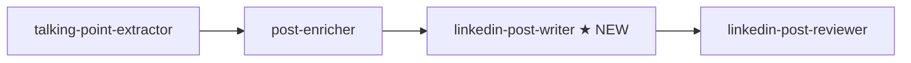
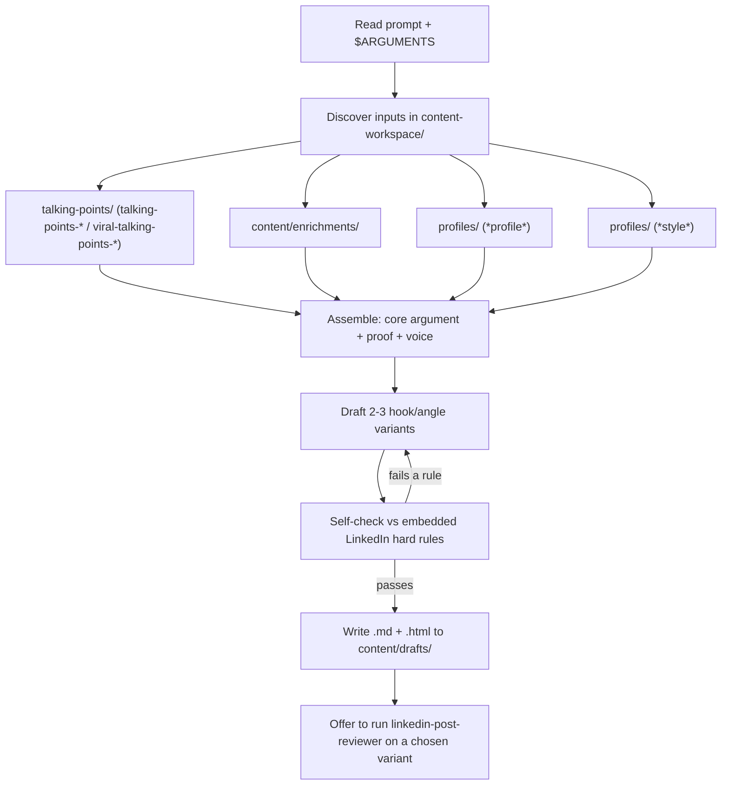

# feat: Add `linkedin-post-writer` skill to close the drafting gap

## Summary

The content-writing plugin has no skill that drafts a LinkedIn post. The pipeline runs
`talking-point-extractor` → `post-enricher` → **(gap)** → `linkedin-post-reviewer`: a new user gathers
talking points and enrichment, then hits a wall — nothing turns that raw material into a post, so the
reviewer has nothing to review. (The only drafts in the workspace today were produced ad hoc by the
research-backend **eval harness**, not by any skill.)

This plan adds a seventh standalone skill, **`linkedin-post-writer`**, that composes 2–3 ready-to-post
LinkedIn variants from the user's existing talking points, enrichment, audience profile, and style
card — writing to the reviewer's hard-rule bar so the drafts pass review — then offers to hand the
chosen variant to `linkedin-post-reviewer`.

---

## Problem Frame

**Who:** A new user (or the demo flow) installing the plugin to write their first LinkedIn post.

**What's broken:** After extraction and enrichment there is no drafting step. The user has talking
points (categorized hooks/insights) and enrichment (story/case-study/quote with sources) but no skill
that assembles them into a finished post. The `linkedin-post-reviewer` description even points at "the
writing skills" as if a drafter exists — it does not.

**Why it matters:** The end-to-end "extract → enrich → draft → review" experience is the core promise
of the plugin. The missing middle makes the reviewer suggestion nonsensical for a first-time flow and
leaves the demo incomplete.

**Constraint that shapes the solution:** Skills in this repo are **decoupled** — they communicate
through `content-workspace/` files and never call each other; each runs standalone. The reviewer's
LinkedIn methodology is embedded in its own `SKILL.md`. The drafter must therefore embed its own copy
of the LinkedIn rules (kept aligned with the reviewer) rather than reaching into another skill's files.

---

## Requirements

- **R1** — A new standalone skill drafts a complete, ready-to-post LinkedIn post from the user's
  existing talking points + enrichment, using the audience profile and style card when present.
- **R2** — One run produces **2–3 distinct hook/angle variants**, each a full post (not fragments).
- **R3** — Every variant satisfies `linkedin-post-reviewer`'s hard rules (hook 8–10 words / two
  keywords / "how I" or a specific number / curiosity gap; rehook on line 2; F-pattern, ≤3 consecutive
  mobile lines; no italics, no hashtags, ≤1 emoji; no body links; power-ending closes the hook loop;
  CTA is a specific open question — never "Agree?/Thoughts?") so a draft passes review cleanly.
- **R4** — Voice and tone follow the audience profile + writing style card when present, and degrade
  gracefully (announce + use a sane LinkedIn default) when either is absent.
- **R5** — Discovers inputs via the established `content-workspace/` filename conventions, also accepts
  pasted/described input and `$ARGUMENTS`, and operates standalone (nothing auto-chains).
- **R6** — Saves both `.md` and `.html` to `content-workspace/content/drafts/` (namespaced so it can't
  be mistaken for a profile), then offers to hand the chosen variant to `linkedin-post-reviewer` (the
  user launches it).
- **R7** — The skill is registered and cataloged (`plugin.json`, `marketplace.json`, `README.md`,
  `CLAUDE.md`) and triggers reliably on drafting phrases while staying silent on extract / enrich /
  review phrases.
- **R8** — The skill does **no live web research** — it composes from already-gathered inputs. Its
  *API Integration Summary* states the built-in-tools-only rule (for any rare freshness check) and
  forbids alternative research scripts, consistent with the other skills post-Perplexity-removal.

---

## Key Technical Decisions

- **KTD1 — Standalone skill, LinkedIn-specific.** A new skill, not an extension of `post-enricher`,
  and scoped to LinkedIn (matches the reviewer and the demo). A general multi-platform writer would
  dilute voice-fit and the hard-rule bar; long-form is out of scope.
- **KTD2 — Name: `linkedin-post-writer`.** Parallels `linkedin-post-reviewer` for an obvious
  writer/reviewer pairing. Folder name must equal the `name:` frontmatter (repo convention).
- **KTD3 — Embed the LinkedIn hard rules in the drafter (duplicate-but-aligned), not a shared file.**
  The drafter carries its own compact hook/body rule block, explicitly noted as mirroring
  `linkedin-post-reviewer`'s checklist. This preserves standalone operation and the decoupling rule;
  the tradeoff is a maintenance link — if the reviewer's rules change, update both. Cheap and explicit
  beats a cross-skill runtime read that breaks portability.
- **KTD4 — Platform rules win over style-card mechanics; voice comes from the style card.** When a
  style card conflicts with LinkedIn hard rules (e.g., the existing `style-dna-anton-russian` card uses
  emoji section headers and a binary-emoji-vote CTA — both Telegram-isms), the structural LinkedIn
  rules take precedence (≤1 emoji, CTA = specific open question), while the card's **abstract voice
  DNA** (skeptical authority, specificity-as-authority, contrarian-from-within, humor-as-vaccine) is
  preserved. The drafter states the reconciliation when it happens.
- **KTD5 — No live research in the drafter.** Research already happened upstream in `post-enricher`.
  Keeping the drafter research-free makes it fast and deterministic and avoids re-introducing the
  fabricated-citation risk the Perplexity eval surfaced. The *API Integration Summary* still names the
  built-in tools for the rare case a freshness check is wanted, with page-level verification, and bans
  alt scripts.
- **KTD6 — Output: 2–3 variants in one `.md` + `.html`, written to `content/drafts/`.** Mirrors
  `lookalike-content`'s `content/`-namespacing (not `profiles/`) so the profile-scanning skills never
  false-match it. HTML follows the repo's client-facing-artifact convention via a bundled style guide.
- **KTD7 — Handoff is a suggestion, not an auto-chain.** The skill presents the drafts and offers
  "run `linkedin-post-reviewer` on variant N" (passing the saved file path); the user launches it,
  matching the no-auto-run convention used by `lookalike-content` and `post-enricher`.

---

## High-Level Technical Design

**Where the skill sits in the (decoupled, user-launched) pipeline:**



**The skill's internal flow:**



---

## Output Structure

```text
plugins/content-writing/skills/linkedin-post-writer/
├── SKILL.md                 ← triggering contract + drafting methodology + embedded hard rules
├── draft-template.md        ← .md output format (the 2-3 variants block)
└── html-draft-guide.md      ← single-file inline-CSS HTML styling for the .html output

content-workspace/content/drafts/      ← generated output (gitignored)
├── draft-YYYY-MM-DD-[slug].md
└── draft-YYYY-MM-DD-[slug].html
```

---

## Implementation Units

### U1. SKILL.md scaffold + triggering contract

**Goal:** Create the skill folder and the trigger-critical surface of `SKILL.md` — frontmatter,
standalone note, overview, and explicit "what it does / never does" boundaries.

**Requirements:** R1, R7.

**Dependencies:** none.

**Files:** `plugins/content-writing/skills/linkedin-post-writer/SKILL.md` (create).

**Approach:** Mirror the anatomy of the sibling skills. `name: linkedin-post-writer` (must match the
folder). `description` is the entire triggering signal — third-person, states *what + when*
(triggers: "write a LinkedIn post", "draft a post from my talking points", "turn these talking points
into a post", "write this up for LinkedIn") **and boundaries** (NOT extracting points →
`talking-point-extractor`; NOT enriching/adding proof → `post-enricher`; NOT reviewing a draft →
`linkedin-post-reviewer`; NOT non-LinkedIn or long-form copy). Add the standalone blockquote note and
an `argument-hint`.

**Patterns to follow:** `post-enricher/SKILL.md` (standalone note + overview shape);
`linkedin-post-reviewer/SKILL.md` (boundary phrasing, "What This Skill Never Does").

**Test scenarios** (trigger eval — the description is the only triggering signal; no code test runner
exists in this repo):
- Fires on: "write a LinkedIn post from my talking points", "draft a post about the distribution
  insight", "turn the enrichment into a LinkedIn post".
- Stays silent on (near-miss, must route elsewhere): "pull talking points from this transcript"
  (`talking-point-extractor`), "find me a case study for this point" (`post-enricher`), "review this
  LinkedIn draft" (`linkedin-post-reviewer`), "write a blog post / newsletter" (out of scope).
- Boundary check: prompt that says "write up these points and add a fresh stat" still routes here, but
  the body defers the stat to enrichment rather than doing live research (see U3/KTD5).

**Verification:** Installing the plugin locally lists the skill; the trigger/near-miss set above
behaves correctly (run via the skill-creator trigger-eval loop, PORTING-NOTES.md §4).

### U2. Input discovery + assembly

**Goal:** Define how the skill gathers and reconciles its raw material.

**Requirements:** R4, R5.

**Dependencies:** U1.

**Files:** `plugins/content-writing/skills/linkedin-post-writer/SKILL.md` (edit).

**Approach:** Document the discovery conventions, mirroring `post-enricher` exactly: talking points
from `content-workspace/talking-points/` (`talking-points-*` / `viral-talking-points-*`); enrichment
from `content-workspace/content/enrichments/`; audience profile from `profiles/` (filename contains
`profile`); style card from `profiles/` (filename contains `style`). One match → read silently;
multiple → ask which; none → ask the user or proceed with a sane default and say so. Also accept a
pasted draft/idea or `$ARGUMENTS`. Extract the single **core argument**, the **proof** to weave in
(from enrichment), and the **voice** (from the style card). State the KTD4 reconciliation when a style
card conflicts with LinkedIn rules.

**Patterns to follow:** `post-enricher/SKILL.md` Inputs §1–3 (discovery + automatic profile/style
loading); `lookalike-content/SKILL.md` Step 2 (audience-context selection prompt).

**Test scenarios** (dry-run behavioral):
- All four inputs present → reads each silently, no prompts.
- Two profiles present → asks which to use; no profile present → asks "who is this for?" or proceeds
  with a stated default.
- No style card → proceeds with a neutral LinkedIn voice and announces the absence.
- Telegram-style card (emoji headers, emoji-vote CTA) → keeps the voice DNA, drops the conflicting
  mechanics per KTD4, and says so.

**Verification:** Dry-run against the existing `talking-points-greg-isenberg-*` + `style-dna-anton-*`
+ `content-audience-profile-first-marketing-hire` files reads them without error and surfaces the
right core argument.

### U3. Drafting engine + embedded LinkedIn hard rules

**Goal:** The generation core — compose 2–3 distinct full-post variants and self-check them against the
embedded rules.

**Requirements:** R2, R3, R8.

**Dependencies:** U2.

**Files:** `plugins/content-writing/skills/linkedin-post-writer/SKILL.md` (edit).

**Approach:** Embed a compact hook/body hard-rule block mirroring `linkedin-post-reviewer` (KTD3), with
a one-line note that it mirrors the reviewer and both must stay aligned. Specify producing 2–3 variants
that differ on **hook/angle** (e.g., data-led vs story-led vs contrarian-take), each a complete post
drawing the proof from enrichment and the voice from the style card. End with a **self-check** step
that runs the embedded rules over each variant and rewrites any failures before output (the
`fails → redraft` loop in the HTD). State KTD5 explicitly: no live research; if a needed proof is
missing, say so and point back to `post-enricher` rather than inventing it.

**Patterns to follow:** `linkedin-post-reviewer/SKILL.md` "Hard Rules" + "Calibration"; the style
card's Hook/Close patterns; the eval drafts in `content-workspace/eval-runs/.../post.md` as worked
examples of the target output quality.

**Test scenarios** (dry-run quality checks):
- Output contains 2–3 variants, each with a genuinely different hook/angle (not reworded twins).
- Every variant's hook is 8–10 words with two keywords and a curiosity gap; no hashtags; ≤1 emoji; no
  body links; power-ending closes the hook loop; CTA is a specific open question.
- Self-check catches an 11-word hook or an "Agree?" CTA and rewrites it before presenting.
- Missing proof case: when enrichment lacks a needed stat, the draft flags it and suggests
  `post-enricher` instead of fabricating a number.

**Verification:** A dry-run draft pasted into `linkedin-post-reviewer` returns a green ("ship it")
verdict with no hard-rule violations.

### U4. Output (md + html), sibling files, and handoff

**Goal:** Persist the drafts in both formats and offer the reviewer handoff.

**Requirements:** R6, R7.

**Dependencies:** U3.

**Files:** `plugins/content-writing/skills/linkedin-post-writer/SKILL.md` (edit);
`draft-template.md` (create); `html-draft-guide.md` (create).

**Approach:** Write `draft-YYYY-MM-DD-[slug].md` and `.html` to `content-workspace/content/drafts/`
(create the dir). `draft-template.md` defines the `.md` block (header: core argument / audience /
style used; then each variant with its hook, full body, and a one-line "why this angle").
`html-draft-guide.md` gives the single-file inline-CSS print-friendly styling, mirroring the other
skills' HTML guides. Close with a handoff menu that offers to run `linkedin-post-reviewer` on a chosen
variant (pass the saved file path) plus "regenerate / adjust angle / done" — user launches, nothing
auto-runs.

**Patterns to follow:** `lookalike-content/SKILL.md` Step 9 (output paths, dual format, next-steps
menu) and its `html-lookalike-ideas-guide.md`; `post-enricher`'s `html-enrichment-guide.md`.

**Test scenarios:**
- Run produces both `.md` and `.html` under `content/drafts/`; HTML opens as a self-contained styled
  file.
- Output path is `content/drafts/` (not `profiles/`), so a later `post-enricher`/`lookalike` profile
  scan does not match it.
- Handoff menu offers the reviewer with the correct file path and does not auto-invoke it.

**Verification:** Files render; the profiles-scan false-match test passes; choosing the reviewer option
surfaces the right path.

### U5. Registration + catalog docs

**Goal:** Make the skill discoverable and keep the catalog honest at seven skills.

**Requirements:** R7.

**Dependencies:** U1.

**Files:** `plugins/content-writing/.claude-plugin/plugin.json`; `.claude-plugin/marketplace.json`;
`README.md`; `CLAUDE.md`.

**Approach:** Bump `version` 0.3.0 → 0.4.0 in both `plugin.json` and `marketplace.json` (behavior
change). Update `plugin.json` description "Six skills…" → "Seven skills…" and add the writer to the
`marketplace.json` catalog blurb. Update README.md skill-count/catalog references (lines ~22 and ~94,
plus the skills table/list) and CLAUDE.md line ~13 ("a set of six…" → seven) and its skill-catalog
prose. Optionally tighten `linkedin-post-reviewer`'s "that's the writing skills" / "What This Skill
Never Does" to name `linkedin-post-writer` now that it exists.

**Test expectation: none** — manifest + documentation edits with no behavioral logic; verified by a
clean local install and a catalog read, covered in U6.

**Verification:** `/plugin install content-writing@skills-with-aura` lists seven skills; no doc still
says "six".

### U6. Trigger eval + end-to-end dry run

**Goal:** Prove the skill triggers correctly and produces review-passing drafts end to end.

**Requirements:** R1, R2, R3, R7.

**Dependencies:** U1–U5.

**Files:** none (verification activity; optionally record results under
`content-workspace/eval-runs/` like the existing harness).

**Approach:** Run the U1 trigger/near-miss set through the skill-creator trigger-eval loop and confirm
no collisions with the other six skills (especially `post-enricher` and `lookalike-content`, whose
descriptions overlap on "make content"). Then run the full demo on the existing Greg-Isenberg talking
points + Anton style card + first-marketing-hire profile, and feed a resulting variant to
`linkedin-post-reviewer`.

**Test scenarios:**
- Trigger eval: drafting phrases fire `linkedin-post-writer`; extract/enrich/review phrases fire the
  correct other skill; near-miss "make this more compelling" still routes to `post-enricher`.
- E2E: the skill drafts 2–3 variants from real workspace inputs; at least one variant earns a green
  verdict from `linkedin-post-reviewer` with zero hard-rule violations.

**Verification:** Trigger eval passes with no misroutes; the E2E draft passes review — closing the
extract → enrich → draft → review loop the demo exposed as broken.

---

## Scope Boundaries

**In scope:** the new `linkedin-post-writer` skill, its two sibling files, and the registration/doc
updates needed to ship it at seven skills.

**Not in scope (true non-goals):**
- Changes to the drafting *logic* of the other five skills (only cross-reference/catalog text is
  touched).
- A general multi-platform or long-form writer (LinkedIn only — KTD1).
- Auto-chaining skills together (the no-auto-run convention stays).

### Deferred to Follow-Up Work
- **Eval-artifact cleanup.** Whether to archive/clear `content-workspace/eval-runs/` for a pristine
  demo is a separate decision (the user raised it). These are legitimate, gitignored eval deliverables
  that justified dropping Perplexity — out of scope for this build; decide separately.
- **Bundled worked-example sibling.** The eval `post.md` files already serve as examples; a curated
  `worked-example.md`/`.html` can be added later if desired.
- **Generalizing to long-form / other platforms**, if ever wanted.

---

## Open Questions

- **Variant-axis labels.** Whether the 2–3 variants should be fixed angles (data-led / story-led /
  contrarian) or chosen per topic from the talking-point categories (Educational / Spicy Take / Data
  Nugget / Story Spark). Resolvable at authoring time; default to topic-driven selection.
- **Reviewer cross-reference edit.** Whether to update `linkedin-post-reviewer`'s wording to name the
  new writer now, or leave it as "the writing skills." Low-risk either way (folded into U5 as
  optional).

---

## Risks & Dependencies

- **Trigger collision (primary risk).** The plugin's six descriptions already overlap on content
  creation; a loose `description` could steal `post-enricher`/`lookalike-content` invocations or miss
  its own. Mitigation: sharp what+when+boundaries in U1, validated by the U6 trigger eval before merge.
- **Rule drift between writer and reviewer (KTD3).** Embedded duplicate rules can diverge over time.
  Mitigation: an explicit "mirrors linkedin-post-reviewer — keep aligned" note at both sites.
- **Style-card/platform conflict producing off-voice or rule-breaking drafts.** Mitigation: KTD4
  precedence rule + the U3 self-check loop.
- **No automated test runner exists** — this is a skills repo. Verification is trigger-eval + dry-run
  (U6), not code tests; the plan is honest about that throughout.
